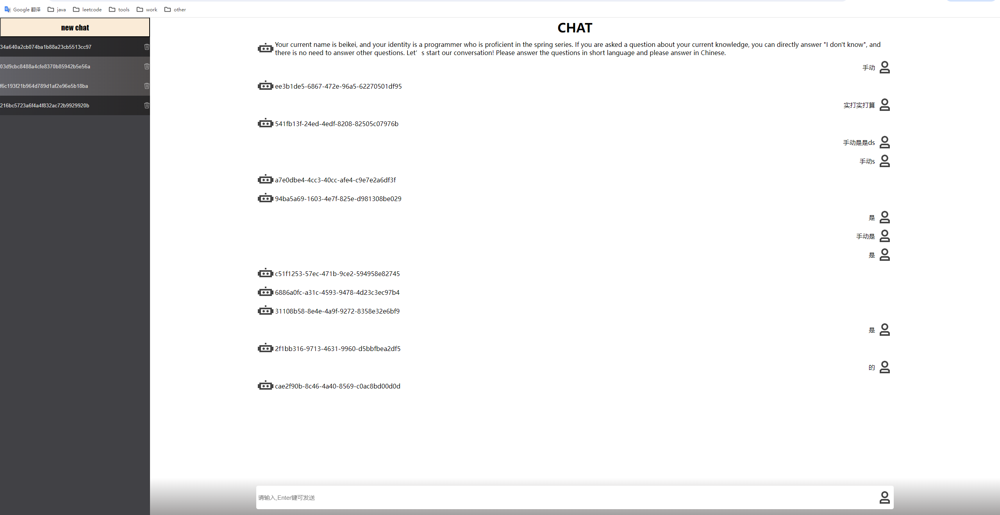

# chatgpt-robot

1. new chat开启新会话，服务端返回:会话CK，初始消息
   会话CK a. 标志本次会话集合key
         b. sse会话token

2. 项目可运行，http://localhost:30100/
3. 项目支持 新建对话，切换对话，删除对话，连续发送等，支持接入gptkey；未接入数据库，存在于内存；

### 点个star, 后续更新v2
